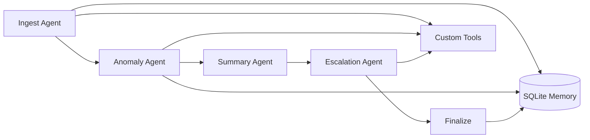

# Fleet Health & Delivery Report Pipeline

Multi-agent maritime operations pipeline that ingests **noon reports**, **port schedules**, **bunker logs**, and **maintenance alerts** to produce a **Fleet Health & Delivery Report** for ship management teams.

**Stack:** Python 3.11+ · LangGraph · FastAPI · Claude API · SQLite · Typer

## Features

- **4 LangGraph agents** — ingest → anomaly detection → summary → escalation → finalize
- **Tool-calling** — deterministic parsers and analytics; full trace in `tool_trace`
- **SQLite memory** — vessel baselines, anomaly history, reports, session context
- **REST API + web dashboard** — generate reports, list samples, view vessel memory
- **CLI** — batch runs without starting the server
- **Src layout** — installable package under `src/fleet_health/`

## Architecture



| Agent | Role | Tools |
|-------|------|-------|
| **Ingest** | Parse and normalise CSV inputs | `parse_noon_report`, `parse_port_schedule`, `parse_bunker_log`, `parse_maintenance_alerts` |
| **Anomaly** | Fuel, schedule, PMS detection | `compute_fuel_variance`, `check_schedule_slippage`, `check_pms_overdue` |
| **Summary** | Superintendent narrative | Claude API + fleet KPI context |
| **Escalation** | Shore-side critical flags | Rules + Claude + `notify_escalation_queue` |

## Project structure

```
fleet-health-pipeline/
├── src/fleet_health/          # Application package
│   ├── agents/                # LangGraph nodes (ingest, anomaly, summary, escalation)
│   ├── tools/                 # Parsers, analytics, export, escalation queue
│   ├── memory/                # SQLite store
│   ├── config.py
│   ├── graph.py               # LangGraph pipeline
│   ├── llm.py
│   ├── main.py                # FastAPI app
│   └── models.py
├── static/                    # Web dashboard (HTML/CSS/JS)
├── data/samples/              # Demo CSV inputs (fleet, nordic_spirit)
├── tests/
├── cli.py                     # Typer CLI entrypoint
├── pyproject.toml             # Package metadata and pytest config
├── requirements.txt
├── .env.example
└── .github/workflows/ci.yml
```

## Prerequisites

- Python **3.11+**
- Optional: [Anthropic API key](https://console.anthropic.com/) for LLM summaries and escalations

## Quick start

```bash
cd fleet-health-pipeline
python -m venv .venv
```

**Windows**

```powershell
.\.venv\Scripts\activate
pip install -r requirements.txt
pip install -e .
copy .env.example .env
```

**macOS / Linux**

```bash
source .venv/bin/activate
pip install -r requirements.txt
pip install -e .
cp .env.example .env
```

Edit `.env` and set `ANTHROPIC_API_KEY` (optional for first run — set `SKIP_LLM=true` for rule-based output only).

### Run CLI

```bash
python cli.py run --data data/samples/fleet --output report.md
python cli.py run --data data/samples/nordic_spirit --imo 9345678
python cli.py fetch <report-id>
python cli.py memory 9345678
```

### Run API + dashboard

```bash
uvicorn fleet_health.main:app --reload --port 8000
```

| URL | Description |
|-----|-------------|
| http://localhost:8000 | Web dashboard |
| http://localhost:8000/docs | Swagger UI |
| http://localhost:8000/api/v1/health | Health check |

### Run tests

```bash
pip install -e ".[dev]"
pytest -v
```

The full Claude integration test runs only when `ANTHROPIC_API_KEY` is set.

## Configuration

| Variable | Default | Description |
|----------|---------|-------------|
| `ANTHROPIC_API_KEY` | — | Claude API key (required for LLM features) |
| `DATABASE_PATH` | `./data/memory.db` | SQLite database path |
| `LLM_MODEL` | `claude-sonnet-4-20250514` | Claude model id |
| `SKIP_LLM` | `false` | Skip Claude calls; use rule-based summaries |
| `LLM_TIMEOUT_SECONDS` | `25` | Per-request LLM timeout |

## API

| Method | Endpoint | Description |
|--------|----------|-------------|
| `GET` | `/api/v1/health` | Health and LLM status |
| `GET` | `/api/v1/samples` | List bundled sample data paths |
| `POST` | `/api/v1/reports/generate` | Generate report from server file paths |
| `POST` | `/api/v1/reports/generate/upload` | Generate report from uploaded CSVs |
| `GET` | `/api/v1/reports` | List stored report IDs |
| `GET` | `/api/v1/reports/{report_id}` | Fetch a report |
| `GET` | `/api/v1/vessels/{imo}/memory` | Vessel baseline and anomaly history |

**Example — generate from sample paths**

```bash
curl -X POST http://localhost:8000/api/v1/reports/generate \
  -H "Content-Type: application/json" \
  -d "{\"noon_path\":\"data/samples/fleet/noon_reports.csv\",\"port_schedule_path\":\"data/samples/fleet/port_schedule.csv\",\"bunker_path\":\"data/samples/fleet/bunker_log.csv\",\"maintenance_path\":\"data/samples/fleet/maintenance_alerts.csv\"}"
```

## Sample vessels

| IMO | Vessel | Expected outcome |
|-----|--------|------------------|
| 9123456 | MV Pacific Star | Normal |
| 9234567 | MV Atlantic Runner | Fuel + schedule issues |
| 9345678 | MV Nordic Spirit | Critical ME/steering + slippage |

## Publishing to GitHub

**Commit:** source (`src/`), tests, `static/`, `data/samples/`, `cli.py`, `pyproject.toml`, `requirements.txt`, `.env.example`, `.gitignore`, docs, CI.

**Do not commit:** `.env`, `.venv/`, `data/memory.db`, `data/escalations/`, `report.md`, `__pycache__/`, `.pytest_cache/`, `*.egg-info/`.

```bash
git init
git add .
git status    # verify secrets and venv are excluded
git commit -m "feat: fleet health multi-agent pipeline"
gh repo create fleet-health-pipeline --public --source=. --push
```

See [START_HERE.md](START_HERE.md) for a short local setup walkthrough.

## CI

GitHub Actions (`.github/workflows/ci.yml`) runs `pytest` on push/PR to `main` or `master`. Optional Claude integration runs when `ANTHROPIC_API_KEY` is configured as a repository secret.

## Disclaimer

Demo system using synthetic data. Not certified for regulatory or commercial navigation decisions.
