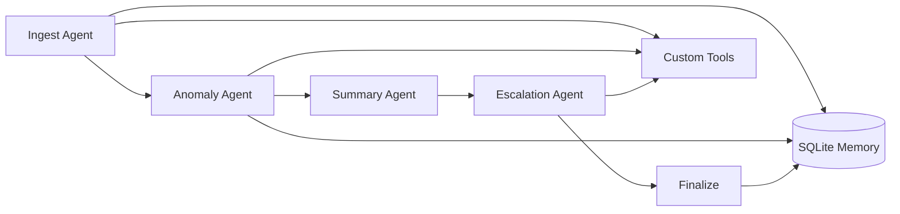

# Fleet Health & Delivery Report Pipeline

Multi-agent maritime operations pipeline that ingests **noon reports**, **port schedules**, **bunker logs**, and **maintenance alerts** to produce a **Fleet Health & Delivery Report** for ship management teams.

Built for the agentic AI mini-project track: **Python · LangGraph · FastAPI · Claude API · SQLite**.

## Architecture



| Agent | Role | Tools |
|-------|------|-------|
| **Ingest** | Parse & normalise CSV inputs | `parse_noon_report`, `parse_port_schedule`, `parse_bunker_log`, `parse_maintenance_alerts` |
| **Anomaly** | Fuel, schedule, PMS detection | `compute_fuel_variance`, `check_schedule_slippage`, `check_pms_overdue` |
| **Summary** | Superintendent narrative | Claude API + fleet KPI context |
| **Escalation** | Shore-side critical flags | Rules + Claude + `notify_escalation_queue` |

## Requirements met

- **Memory** — SQLite (`vessel_baselines`, `anomaly_history`, `reports`, `session_context`)
- **Tool-calling** — Deterministic Python tools + mock escalation queue; trace in `tool_trace`
- **4 agents** — LangGraph sequential graph
- **FastAPI** — `/api/v1/reports/generate`, upload, fetch, vessel memory
- **CLI** — `python cli.py run`

## Quick start

```bash
cd fleet-health-pipeline
python -m venv .venv
.venv\Scripts\activate          # Windows
pip install -r requirements.txt
copy .env.example .env          # add ANTHROPIC_API_KEY
```

### Run CLI (full pipeline)

```bash
python cli.py run --data data/samples/fleet --output report.md
python cli.py run --data data/samples/nordic_spirit --imo 9345678
```

### Run API + Web UI

```bash
uvicorn app.main:app --reload --port 8000
```

- **Dashboard:** http://localhost:8000 — generate reports, view KPIs, anomalies, escalations
- **Swagger:** http://localhost:8000/docs

### Tests

```bash
pytest -v
```

LLM integration test runs only when `ANTHROPIC_API_KEY` is set.

## Sample vessels

| IMO | Vessel | Expected outcome |
|-----|--------|------------------|
| 9123456 | MV Pacific Star | Normal |
| 9234567 | MV Atlantic Runner | Fuel + schedule issues |
| 9345678 | MV Nordic Spirit | Critical ME/steering + slippage |

## API examples

```bash
# Generate from server paths
curl -X POST http://localhost:8000/api/v1/reports/generate \
  -H "Content-Type: application/json" \
  -d "{\"noon_path\":\"data/samples/fleet/noon_reports.csv\",\"port_schedule_path\":\"data/samples/fleet/port_schedule.csv\",\"bunker_path\":\"data/samples/fleet/bunker_log.csv\",\"maintenance_path\":\"data/samples/fleet/maintenance_alerts.csv\"}"

# Vessel memory
curl http://localhost:8000/api/v1/vessels/9345678/memory
```

## Project structure

```
app/
  agents/       # LangGraph nodes (4 agents)
  tools/        # Parsers, analytics, export, escalation queue
  memory/       # SQLite store
  graph.py      # LangGraph pipeline
  main.py       # FastAPI
cli.py
data/samples/
tests/
```

## GitHub

```bash
git init
git add .
git commit -m "feat: fleet health multi-agent pipeline"
gh repo create fleet-health-pipeline --public --source=. --push
```

## Disclaimer

Demo system using synthetic data. Not certified for regulatory or commercial navigation decisions.
